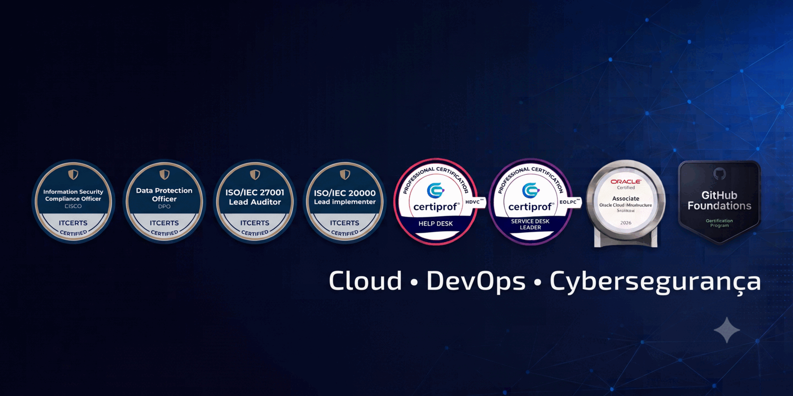

## 🌐 Saudações! Nilo Lima Jr aqui.

Sou um profissional de TI apaixonado por Cloud Computing, DevOps e Infraestrutura moderna. Meu foco é transformar a forma como as empresas entregam software, utilizando automação e resiliência para gerar valor real ao negócio.

Com uma base sólida em tecnologia, hoje dedico meus dias a arquitetar soluções que unem agilidade e estabilidade. Tenho focado intensamente na criação de ambientes modernos, utilizando containers e infraestrutura como código (IaC) para construir ecossistemas escaláveis e de alta disponibilidade.

Acredito que o aprendizado contínuo é a única constante na nossa área, por isso estou sempre envolvido em projetos práticos e laboratórios que desafiam o status quo da infraestrutura tradicional.

## 🛠️ Um pouco mais sobre mim:

* 🚀 Atualmente: Focado em projetos de Cloud & DevOps e em busca de novos desafios profissionais.
  
* 🎯 Objetivo: Aplicar metodologias ágeis e cultura DevOps para otimizar fluxos de entrega.
  
* 💬 Pergunte-me sobre: AWS, Terraform, Docker, Linux e PostgreSQL.
  
* 🌱 Estudando no momento: Kubernetes, Ansible e aperfeiçoando automações em nuvem.
  
* ⚡ Curiosidade: Não começo meu dia sem um café forte e, entre uma automação e outra, ostento com orgulho o título de churrasqueiro oficial da família.
  
## 📫 Contato Direto

Sinta-se à vontade para me chamar para conversar sobre oportunidades, tecnologia ou até mesmo para trocar dicas de churrasco! ☕🥩

* 💼 [Interesse Profissional](https://wa.me/5551999331601?text=Olá%20Nilo%2C%20vi%20seu%20perfil%20no%20GitHub%20e%20gostaria%20de%20falar%20sobre%20oportunidades.)
* 🤝 [Networking e DevOps](https://wa.me/5551999331601?text=Fala%20Nilo!%20Vi%20seus%20projetos%20de%20DevOps%20e%20queria%20trocar%20uma%20ideia.)
* 🥩 [Café e Churrasco](https://wa.me/5551999331601?text=Oi%20Nilo%2C%20vi%20que%20você%20curte%20café%20e%20churrasco%2C%20bora%20conectar%3F)

 

  
    
  
  
  

  
## 🏆 Certificações e 📈 Atividades no GitHub 

  
 Certificações e Licenças 

<!--START_SECTION:badges-->

<!--END_SECTION:badges-->

 

  
 Atividades no GitHub 

    

      
      
      
    

 

<!--
## 📊 Estatísticas

 
-->

<h2> Skills  </h2>

<table>
  <tr>
    <td></td>
    <td></td>
    <td></td>
    <td></td>
    <td></td>
    <td></td>
    <td></td>
    <td></td>
    <td></td>
    <td></td>
  </tr>
  <tr>
    <td></td>
    <td></td>
    <td></td>
    <td></td>
    <td></td>
    <td></td>
    <td></td>
    <td></td>
    <td></td>
    <td></td>
  </tr>
  <tr>
    <td></td>
    <td></td>
    <td></td>
    <td></td>
    <td></td>
    <td></td>
    <td></td>
    <td></td>
    <td></td>
    <td></td>
  </tr>
  <tr>
    <td></td>
    <td></td>
    <td></td>
    <td></td>
    <td></td>
    <td></td>
    <td></td>
  </tr>
</table>

 

## Projetos Open Source ✨

| Projetos | Descrição |
|---------|-------------|
| 🤖 **[gemini-cli-contexto-framework](https://github.com/nilo-lima/gemini-cli-contexto-framework)** | Framework para automação de infraestrutura utilizando IA e Gemini CLI. |
| 🏗️ **[lab-infra-linux-enterprise](https://github.com/nilo-lima/lab-infra-linux-enterprise)** | Laboratório completo de infraestrutura Linux Enterprise (DHCP, DNS, etc.). |
| 🐧 **[debian-devops-lab](https://github.com/nilo-lima/debian-devops-lab)** | Ambiente de laboratório focado em práticas DevOps utilizando Debian. |

 

## 💖 Apoie meu trabalho

Se você gosta dos meus projetos, considere:
- ⭐ Dar uma estrela nos repositórios.
- 🐛 Reportar bugs ou melhorias.
- 🤝 Contribuir com código.

 

---

**💎 Gostou do meu perfil?**  [Me indique para o GitHub Stars](https://stars.github.com/nominate/).